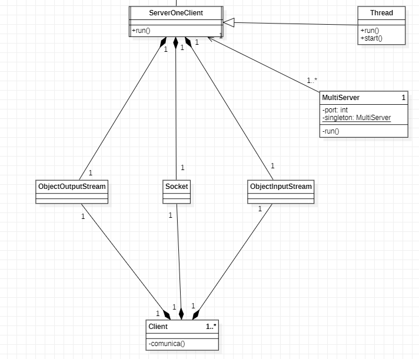
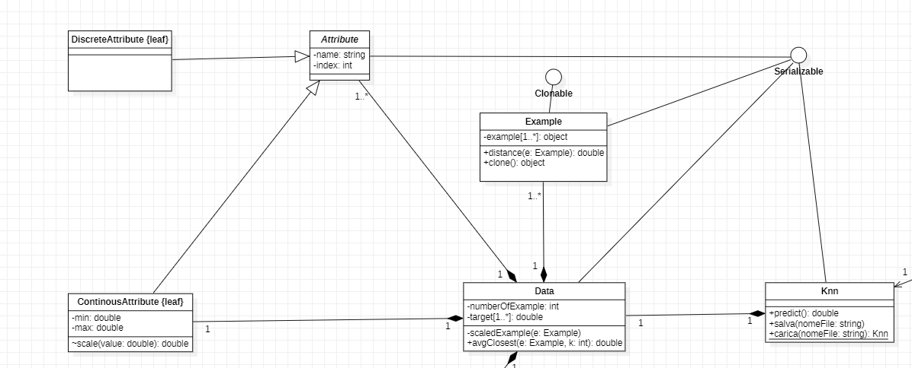
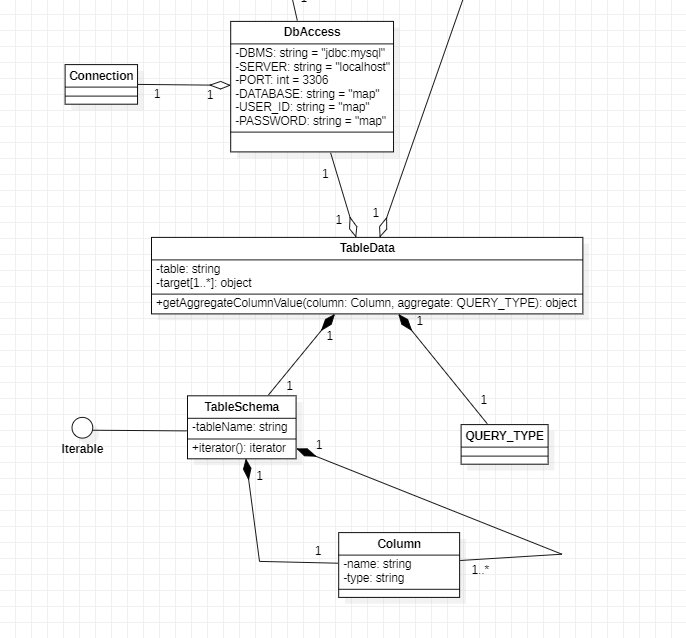
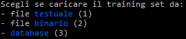
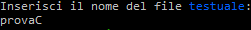
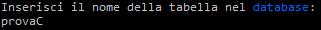
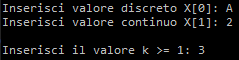
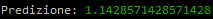
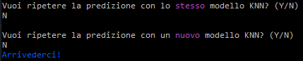

# **KNN MINER**

## Indice

---
[1. Introduzione del progetto](#1-introduzione-del-progetto)

[2. Guida di installazione](#2-guida-di-installazione)
- [2.1 Installazione MYSQL](#21-installazione-mysql)
- [2.2 Installazione applicazione](#22-installazione-applicazione)
- [2.3 Importazione su Eclipse](#23-importazione-su-eclipse)

[3. Diagrammi delle classi](#3-diagrammi-delle-classi)

[4. Manuale Utente](#4-manuale-utente)

---

## **1. Introduzione del progetto**

 <b>KNN Miner</b> sfrutta l'algoritmo di regressione <b>KNN</b> del <i>data mining</i>,
finalizzato alla predizione del valore di un attributo numerico associato a un esempio sulla base di
valori osservati per altri attributi dell’esempio medesimo.  
Quindi, dato un training set <b>(X, Y)</b>, un esempio X denominato <i>query</i> per il quale il valore Y sia
sconosciuto e un intero k > 0, viene predetto il valore sconosciuto di Y associato ad X identificando i
k esempi del training set più vicini ad X e restituendo la media dei valori Y nei k vicini selezionati. 
L'algoritmo riceve in input una collezione di esempi di apprendimento (training set) dove ciascun
esempio è formato da una tupla di valori per un prefissato insieme di attributi (variabili indipendenti)
<b>X = {X1, X2, ..., Xn}</b>
e un attributo di classe numerico (variabile dipendente/target). L’attributo Xi
è descritto come continuo o discreto a seconda che i sui valori siano numerici o nominali.
L’attributo di classe Y è numerico e ha valori nell’insieme dei numeri reali.  
Per distinguere gli esempi più vicini bisogna trovare la loro <u>distanza</u> dalla query.
Per far ciò bisogna comportarsi in modi diversi a seconda del tipo di dato dell'attributo.  Se questo è discreto, è sufficiente trovare la distanza di hamming tra l'attributo corrispondente della query e dell'esempio esaminato in quel momento; se questo è continuo, invece, è necessario trovare la differenza in valore assoluto dei valori numerici, dopo aver scalato l'attributo in maniera tale da farlo rientrare nel range <i>[0, 1]</i>. 
Per fare ciò si ricorre alla tecnica del <b>min-max scaler</b>: si trova il massimo e il minimo tra tutti i
valori dell'attributo presenti nel training set e il nuovo valore è definito dall'espressione:
<b>newValue = (value - min) / (max - min).</b> Per trovare la distanza totale, infine, è sufficiente sommare le distanze trovate con i vari
attributi.  
Il valore target della query sarà definito dalla media dei target dei k esempi più vicini.
Nel caso in cui dovessero esserci più esempi alla stessa distanza dalla query,
è necessario considerare nel calcolo della media tutti gli esempi coinvolti.

---

## **2. Guida di installazione**
## 2.1 Installazione MYSQL
---
La libreria esterna per connettersi da *java* su *mysql* utilizzata è la **mysql-connector-java-8.0.17.jar**.

- Autenticarsi da terminale su *mysql* con l'utente __root__;
- Spostarsi nella directory corrente tramite comando `cd directory` (o qualunque altra directory, l'importante è che ci sia il file **setup.sql**);
- Eseguire il seguente comando: 
    > __`SOURCE setup.sql;`__

Lo script sql eseguirà le seguenti operazioni:
1. Creare l'utente **map** con password **map** (se c'era già prima lo elimina);
2. Creare il database **map** se non già presente;
3. Dare tutti i privilegi all'utente **map** sul database **map**;
4. Creare la tabella **provaC** e **servo** nel database **map** (se c'era già prima la elimina);

## 2.2 Installazione applicazione
---
Requisiti: **git bash**

Per poter utilizzare l'applicazione è **necessario** prima avviare il server.

Avviare quindi il server direttamente avviando il file `server.sh` da terminale *git bash* tramite il comando `sh server.sh` oppure, in alternativa, direttamente tramite il file __jar__, attraverso il comando da eseguire nella cartella *Server*:
> __`java -jar Server.jar`__

 

Allo stesso modo, avviare i/il client direttamente avviando il file `client.sh` da terminale *git bash* tramite il comando `sh client.sh` oppure, in alternativa, direttamente tramite il file __jar__, attraverso il comando da eseguire nella cartella *Client*:
> __`java -jar Client.jar`__

 

**NB:** E' possibile avere aperto un unico **Server** alla volta, infatti il sistema impedirà di aprirne più di uno contemporaneamente. Per questo motivo fare attenzione quando si prova a chiudere il terminale del server: usare la combinazione __CTRL+C__ invece di chiudere direttamente il terminale perchè altrimenti il processo java rimarrà ancora in esecuzione(in quel caso bisogna terminare il processo dal task manager)! 

E' invece possibile avviare più **Client** contemporaneamente.

## 2.3 Importazione su eclipse
---
Per poter importare su eclipse, è necessario importare due progetti differenti, una volta importando la cartella __Server__ ed un'altra la cartella __Client__.

## **3. Diagrammi delle classi**

Di seguito sono riportati gli screen relativi ai diagrammi delle classi suddivisi in 3 foto (server, database e knn).

Server:

Knn:

Database:

Oltre a ciò bisogna considerare che tra la classe ServerOneClient e Knn è presente una associazione diretta 1 a 1.

Tra la classe Example e TableData è presente un'aggregazione 1..* a 1.

## **4. Manuale Utente**
---
All'apertura dell'applicazione client, l'utente dovrà scegliere con quale modalità caricare il training set come da figura:

Se si sceglie l'opzione **1)** o **2)**, l'applicazione chiederà il nome del file. Inserire il file da caricare nella cartella __Server/training_set__ e quindi scrivere il nome del file **senza** l'estensione: verrà presa in automatico dal Server(__.dat__ per i file testuali, __.dmp__ per i file binari).

Se si sceglie l'opzione **3)** l'applicazione chiederà il nome della tabella, quindi inserire il nome della tabella corretta.

Una volta caricato correttamente il training set, verrà stampato il messaggio **"Modello KNN caricato con successo!"**.

A questo punto, l'applicazione chiederà di inserire l'esempio da predire facendo attenzione al tipo di dato (discreto o continuo) ed infine il valore di k:

Il server risponderà quindi con la predizione corretta:

Se si vuole continuare ad eseguire predizioni sul modello caricato, scrivere **Y**, altrimenti **N**.
Se si preme **N**, verrà chiesto se caricare un nuovo modello (rispondere quindi allo stesso modo con **Y** o **N**).

Se si risponde con **N** anche a questa seconda domanda, l'applicazione si chiuderà.

