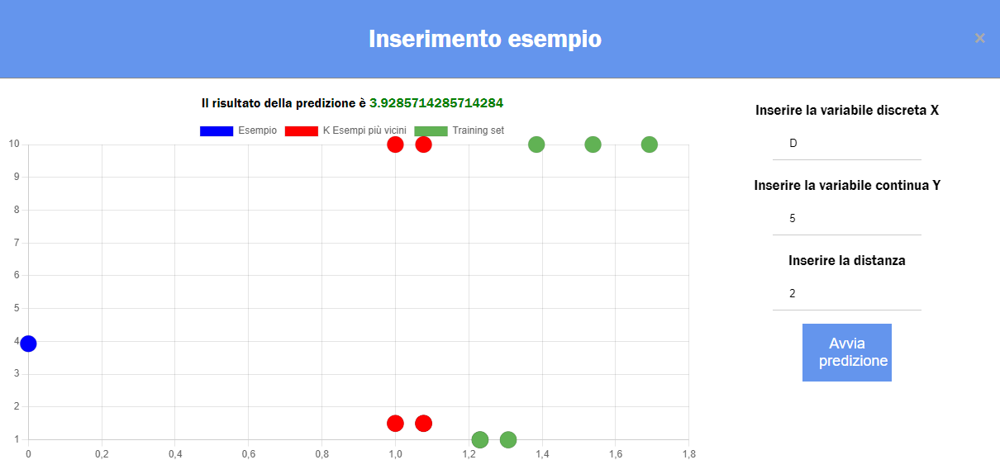

# **KNN MINER esteso**

## Indice

---
[1. Differenze del progetto esteso](#1-differenze-del-progetto-esteso)

[2. Guida di installazione](#2-guida-di-installazione)
- [2.1 Installazione MYSQL](#21-installazione-mysql)
- [2.2 Installazione applicazione](#22-installazione-applicazione)
- [2.3 Importazione su eclipse](#23-importazione-su-eclipse)

[3. Diagrammi delle classi](#3-diagrammi-delle-classi)

[4. Manuale Utente](#4-manuale-utente)

---

## **1. Differenze del progetto esteso**
---
Il progetto sviluppa una grafica client sul web implementata tramite **html**, **css** e **javascript**. E' stata adottata un'architettura **REST api** in cui il client per poter comunicare con il server effettua delle chiamate asincrone da javascript alle api di **Spring** (Java).

Spring, infatti, ad ogni tentativo di chiamata dal client creerà un nuovo thread a partire dai metodi nella classe **KNNController**.

E' stato aggiunto anche un thread in background che elimina ogni ora i modelli **KNN** dei client salvati sul server.

## **2. Guida di installazione**
## 2.1 Installazione MYSQL
---
La libreria per connettersi a mysql è inclusa nei package di spring. Le modalità di connessione al DB sono equivalenti a quelle del progetto base, ovvero:

- Autenticarsi da terminale su *mysql* con l'utente __root__;
- Spostarsi nella directory corrente tramite comando `cd directory` (o qualunque altra directory, l'importante è che ci sia il file **setup.sql**);
- Eseguire il seguente comando: 
    > __`SOURCE setup.sql;`__

Lo script sql eseguirà le seguenti operazioni:
1. Creare l'utente **map** con password **map** (se c'era già prima lo elimina);
2. Creare il database **map** se non già presente;
3. Dare tutti i privilegi all'utente **map** sul database **map**;
4. Creare la tabella **provaC** e **servo** nel database **map** (se c'era già prima la elimina);

## 2.2 Installazione applicazione
---
Requisiti: **jdk-17**, **git bash**

Per poter utilizzare l'applicazione è **necessario** prima avviare il **server web** di spring (la porta utilizzata sarà la 8080).

Avviare quindi il server direttamente avviando il file `server.sh` da terminale *git bash* tramite il comando `sh server.sh` oppure, in alternativa, direttamente tramite il file __jar__, attraverso il comando da eseguire nella cartella *Server*:
> __`java -jar Server.jar`__

 

Per poter avviare l'applicazione tramite **Client** è necessario aprire un browser qualunque e recarsi all'indirizzo:
> __`localhost:8080`__

 

**NB:** E' possibile avere aperto un unico **Server** alla volta, infatti il sistema impedirà di aprirne più di uno contemporaneamente. Per questo motivo fare attenzione quando si prova a chiudere il terminale del server: usare la combinazione __CTRL+C__ invece di chiudere direttamente il terminale perchè altrimenti il processo java rimarrà ancora in esecuzione(in quel caso bisogna terminare il processo dal task manager)! 

E' invece possibile connettersi tramite più **Client** in diverse pagine web contemporaneamente.

## 2.3 Importazione su eclipse
---
Il progetto esteso funziona solamente con la **jdk-17** di Java. Se non si dispone di questa versione scaricarla da [questo link](https://www.oracle.com/java/technologies/javase/jdk17-archive-downloads.html).

1) Per poter importare su eclipse il progetto, è necessario scaricare dal marketplace di eclipse l'estensione `'Buildship Gradle Integration 3.0'`. 

2) Una volta fatto ciò, importare tramite Gradle con la voce `'Existing Gradle Project'` e selezionare nella voce `'Project root directory'` la cartella `'KNN esteso/knn'` e cliccare su Finish.

3) L'ultima cosa da fare è indicare a Gradle il corretto percorso della jdk-17. Recarsi in `'Window -> Preferences -> Gradle'`, selezionare la Java home indicando il corretto percorso (dovrebbe trovarsi in questo percorso `'C:\Program Files\Java\jdk-17.0.0'` su Windows).

Se tutto è andato a buon fine, il progetto è stato correttamente importato in Eclipse.

## **3. Diagrammi delle classi**

Di seguito sono riportati gli screen relativi ai diagrammi delle classi suddivisi in package.

Generale:

Server:

Mining:

Data:

Example:

Database:

Per ragioni di leggibilità, di seguito sono specificate eventuali associazioni con le classi, qualora non si dovessero capire dagli screen.

Tra la classe Server e la classe Knn è presente un'associazione direzionata 1 a 1.

Tra la classe Data e la classe Knn è presente una composizione 1 a 1.

Tra la classe Data e DbAccess è presente una composizione 1 a 1.

Tra la classe Example e la classe Data è presente una composizione 1..* a 1.

Tra la classe Example e TableData è presente un'aggregazione 1..* a 1.

## **4. Manuale Utente**
---
All'apertura del browser all'indirizzo `localhost:8080`, l'utente dovrà scegliere con quale modalità caricare il training set dal menù a tendina come da figura:

Se si sceglie l'opzione **File**, l'applicazione chiederà il percorso **assoluto** del file che si vuole caricare (precisando l'estensione). 

Se si sceglie l'opzione **File serializzato**, l'applicazione chiederà il percorso **assoluto** che si vuole caricare (precisando l'estensione). 

Se si sceglie l'opzione **Database** l'applicazione chiederà il nome della tabella, quindi inserire il nome della tabella corretta (ovviamente dovranno essere in funzione i servizi del DBMS).

Una volta inserito correttamente il training set, basterà cliccare sul button **Carica Modello**.

Una volta caricato correttamente il training set, verrà mostrata una schermata dove è visibile un grafico a bolle ove l'asse X rappresenta la distanza dalla query, l'asse Y rappresenta il target degli esempi.

A fianco del grafico, l'applicazione chiederà di inserire l'esempio da predire facendo attenzione al tipo di dato (discreto o continuo) ed infine la distanza (il valore k):

Una volta inseriti correttamente i dati e dopo aver cliccato sul button **Avvia Predizione**, il grafico si popolerà con diversi pallini dove, in base alla loro posizione, assumeranno un colore differente per mostrare i k esempi più vicini rispetto all'esempio inserito dall'utente, inoltre verrà anche mostrato in alto al grafico il risultato della predizione.

Se si vuole continuare ad eseguire predizioni sul modello caricato, basterà rimanere sulla stessa schermata e inserire i nuovi dati.

